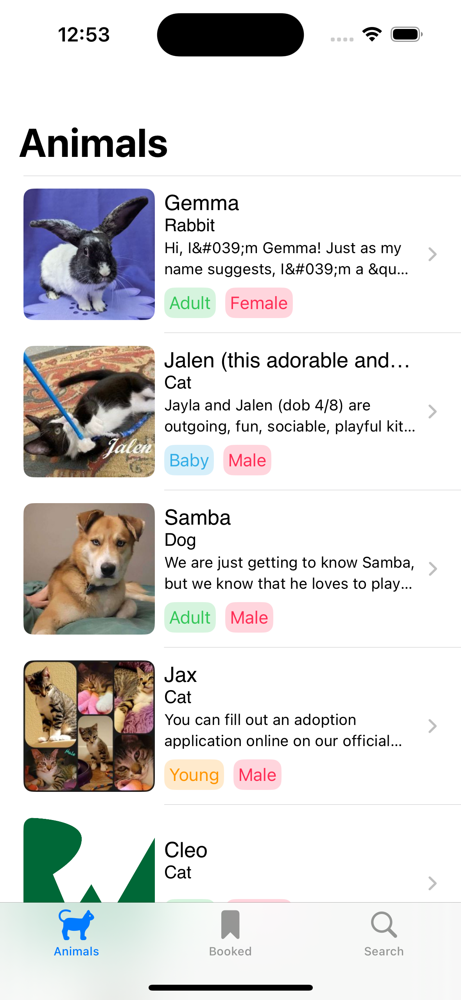
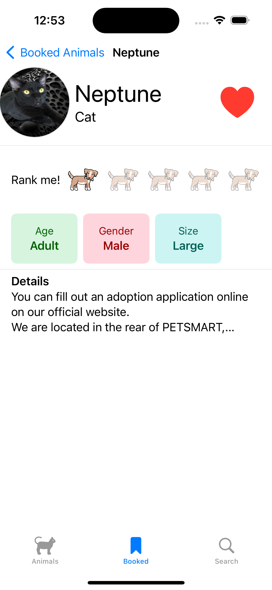
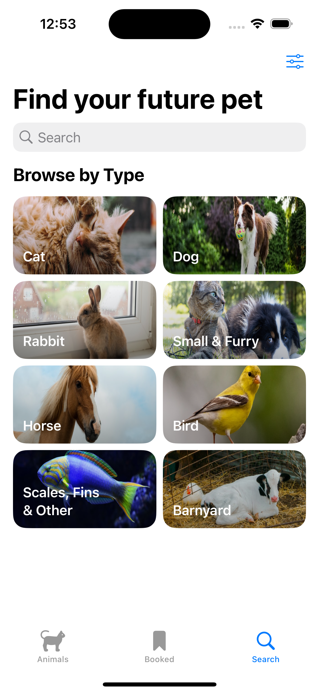

# RealWorldiOS_ModernSUILearn

リポジトリについて:  過去に勉強したSwiftUIプロジェクトで完了です。

オリジナルの自作アプリは
https://github.com/KaneEast/VocabularyRemember
で23年10月末から進行中です。

Swift SwiftUI Networking Realm UnitTest

## スクリーンショット
|      |      |      |      |
|:----:|:----:|:----:|:----:|
|  |  |  |  |
