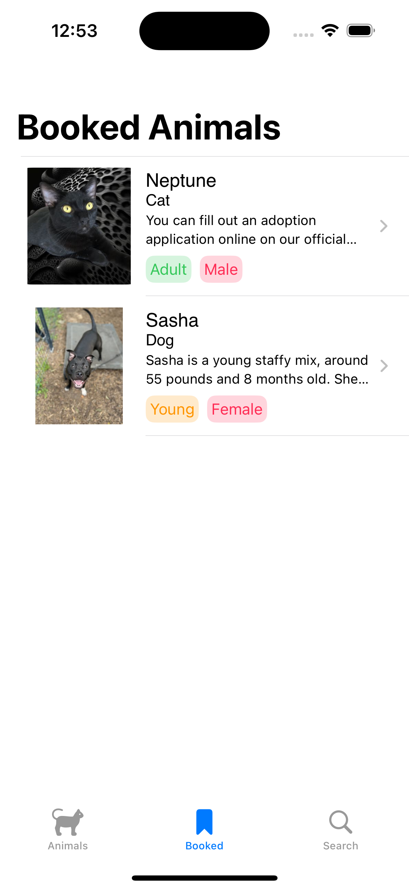

# RealWorldiOS_ModernSUILearn

リポジトリについて:  過去に勉強したSwiftUIプロジェクトで完了です。

オリジナルの自作アプリは
https://github.com/KaneEast/VocabularyRemember
で23年10月末から進行中です。

## Tech Stack
1. Swift
2. SwiftUI
3. Networking
4. Realm
5. UnitTest

## スクリーンショット

  
  
  

  
  

